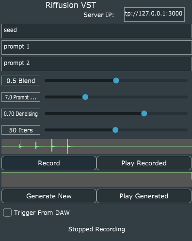

# RiffusionVST
 A VST3 plugin for Riffusion based on JUCE.

 ## What is a VST3 plugin?
 A [vst](https://steinbergmedia.github.io/vst3_doc/vstsdk/index.html) plugin is a standard interface for digital audio workstations (DAW) to process and generate audio. Examples include instruments and effects.

 ## Why use a VST plugin for Riffusion?
 Riffusion is an experimental tool for generating music from image files. It lives in python, and transmits data via HTTP. It requires an expensive and powerful GPU to run. If you have an expensive and powerful GPU or have a friend who has one, why not record, edit, and paste audio directly into your music workstation?

 The VST plugin allows you to do this (albiet in a pretty janky and not very user friendly way).

## How does this even work?

```


  ┌─────────────────────┐
  │                     │                               ┌──────────┐
  │                     ├┬───────────┐AUDIO VIA HTTP    │          │
  │      YOUR           ││  RIFFUSION├───────────►      │  Riff.   │
  │       DAW           ││    VST    │                  │   Server │
  │                     ││  PLUGIN   │                  │ (PYTHON) │
  │                     ├┴───────────┘◄─────────────────┤          │
  │                     │    (c++)       AUDIO VIA HTTP └──────────┘
  └─────────────────────┘

```
The Riffusion VST plugin lives in C++ and communicates with your DAW by raw memory access. It keeps around two things: a recording buffer and a generation buffer. When you click a button, it sends the recording buffer to the Riffusion Server, which is running in python, via HTTP. The server could potentially be running on another computer, but I have only ever tested it on a local computer.

When riffusion is done (usually many seconds later), audio is written to the Riffusion VST plugin, and then can be played back into your DAW.

## Notes on Use
This is an experimental VST3 plugin for interfacing with Riffusion (https://github.com/riffusion/riffusion). You must be able to run Riffusion locally using mklingen's special branch (https://github.com/mklingen/riffusion-inference/). Then, this will generate a VST3 plugin for you, and a standalone app.

As of writing, this DOES NOT WORK with standard riffusion servers, you must be using mklingen's special branch.


> The above is a screenshot of the plugin running standalone.

## Install from a Release
1. Download mklingen's special branch, and run the vst server after the lengthy install steps, getting torch setup, conda, etc. https://github.com/mklingen/riffusion-inference
2. Go to the [releases page](https://github.com/mklingen/RiffusionVST/releases) and select the release appropriate for you. At the time of writing, only releases for 64 bit windows have been generated. I haven't been able to generate Mac based plugins, but it's possible you could build them yourself if you're able to build AU plugins from JUCE on your computer.
3. Download the release and put the .vst3 into the place where you normally put VST3 plugins.
4. Launch your DAW, and scan for the RiffusionVST plugin.
5. Run the Riffusion server locally (or, if you have some powerful build machine somewhere, run it there).
6. Point the plugin at the IP address of your riffusion server with port 3000 (if running locally, you won't have to do anything).

## Build from Source
1. Download mklingen's special branch, and run the vst server after the lengthy install steps, getting torch setup, conda, etc. https://github.com/mklingen/riffusion-inference
2. Download and install [juce](https://juce.com/get-juce/download), including Projucer.
3. Open `RiffusionVST.jucer`, and run through the steps of generating a project, either in Visual Studio or XCode. Then, you should see an option like `File > Save and Open in IDE`, which should open either visual studio, xcode or some other IDE for developing C++ code.
4. On Windows: Build this plugin in Visual Studio after using projucer to generate Visual Studio project files.
5. A plugin will be generated in the `Builds` folder.
6. Add the plugin to your favorite DAW.
7. Run the Riffusion server locally (or, if you have some powerful build machine somewhere, run it there).
8. Point the plugin at the IP address of your riffusion server with port 3000 (if running locally, you won't have to do anything).

## Use
1. Attach the VST plugin as an effect processor. For example in FL studio this would be the same kind of thing as a reverb effect on an audio track.
2. Set up audio input into the VST plugin from your DAW. This could come from the microphone, or a Send output from one of your tracks.
3. Click "Trigger from Daw" so that the plugin won't start recording until the DAW starts playing audio. Alternatively, you can leave that unchecked to record audio freeform.
4. Click "Record". Up to 5 seconds of audio can be recorded. If you are using "Trigger from Daw", the audio won't be recorded until you press Play in your DAW. Observe a green waveform appear.
5. Hit "Play Recorded" and the audio will play on the track that the RiffusionVST is attached to. If "Trigger from DAW" is pressed, this will try to play back in the same location in your song that it was recorded from. Otherwise, it will play immediately.
6. When you are satisfied with this, press "Generate New".
7. Check the status on the Riffusion VST server in the terminal. It may be really slow. You may need to poke it by hitting "enter" in the console. I don't know if that actually makes it work faster, but I do it sometimes.
8. If all succeeded, the generated audio will be visible as a green waveform in the second from last row.
9. You can now repeat step (5) to play back the generated audio by pressing "Play Generated".
10. Now, the hard/fun part. You will need to record the audio back into the DAW manually. Since this is just an effect processor, that would mean finding a way to send audio from the track that RiffusionVST is playing on into another track and recording it there. Don't forget to mute any sends that are going into that track.
11. Experiment with seeds and prompts. The seed can be anything, it's just a random number or text. "Blend" controls the amount that prompt 1 and prompt 2 will be respected. Prompt 1 = blend of 0. Prompt 2 = blend of 1. "Denoising" seems to control how close the audio stays to the original recording. Denoising of 0 means no change to the original, denoising of 1 means Riffusion just makes up whatever it wants. Iters, I've never found to change the quality so I'd best leave it at 50.

## Known Limitations
* All of this is experimental, no professional is behind this. Riffusion is experimental. The server I developed on top of it is experimental. The plugin is experimental. Have fun!
* Something funky is going on with the 5 second buffer. I think riffusion actually might expect a 5.14 second buffer or something, so you are likely to get an ugly pop at the end of the buffer.
* Time sync and looping are both pretty buggy. I've found it very hard to get tracks to loop correctly, so if you're good at doing that manually with samples you've taken from other songs, you will have to use those skills here.
* Again, before doing any of this you need to get Riffusion running locally or on a build server that you have access to. That means you need to know how to install python, setup conda, get the dependencies, oh and have a powerful expensive GPU.